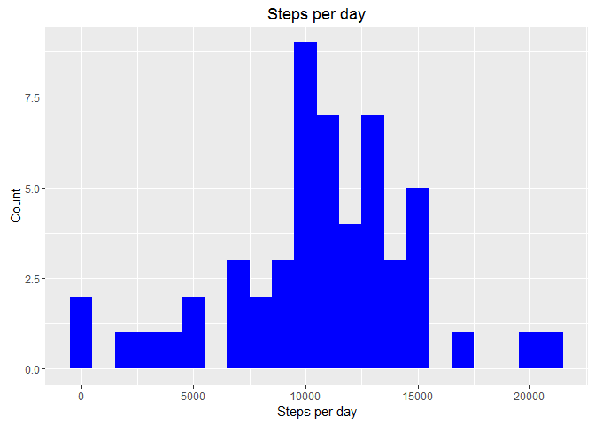
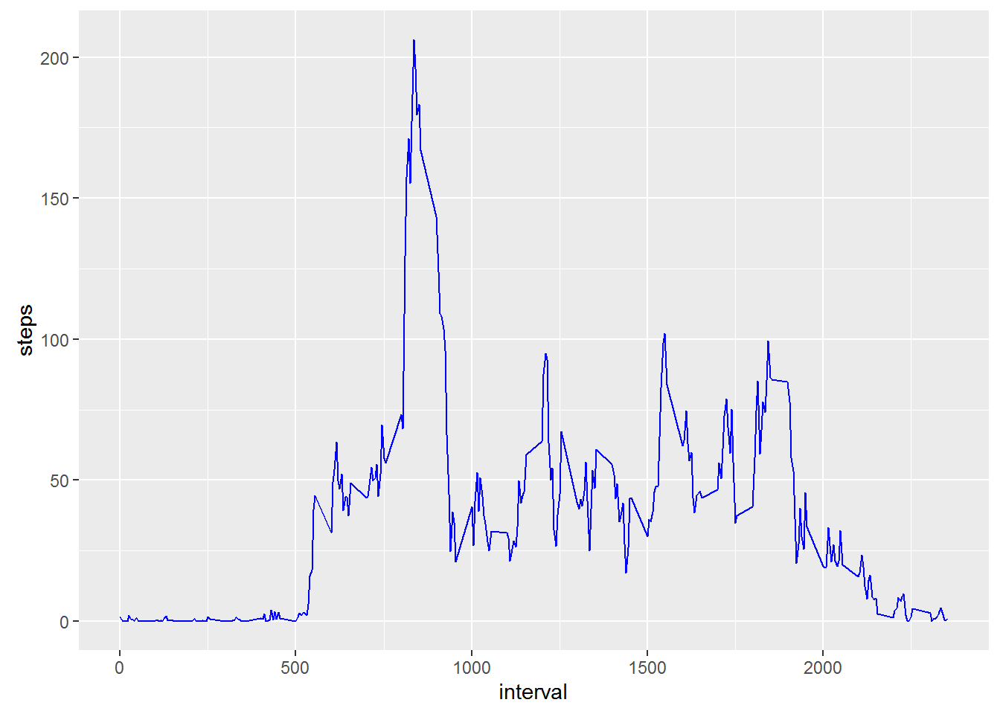
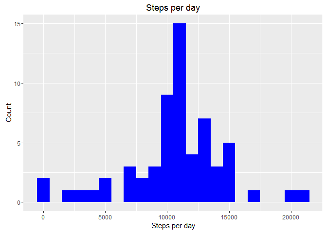
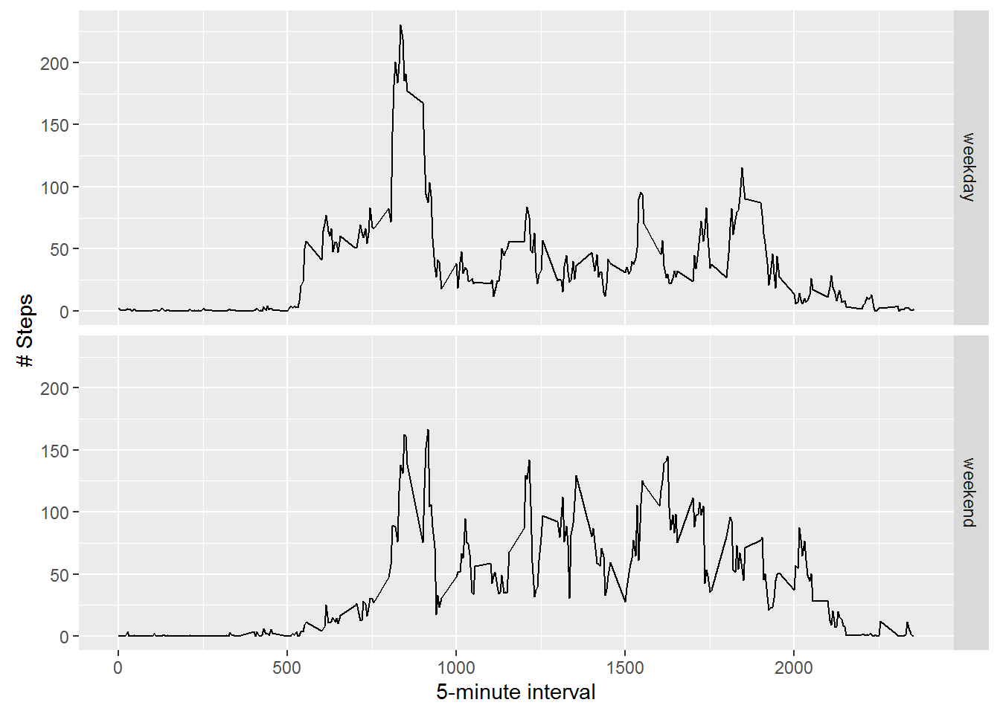

# Reproducible Research: Peer Assessment 1
Casey Kangas  
October 9, 2016  

## Loading and preprocessing the data

Below is the R code used to download the activity dataset and read it into
a dataframe


```r
# download and extract the data
url <- "https://d396qusza40orc.cloudfront.net/repdata%2Fdata%2Factivity.zip"
download.file(url,destfile="./activity.zip")
unzip(zipfile="./activity.zip",exdir=".")

# ingest activity csv
activity <- read.csv("./activity.csv")
```


## What is mean total number of steps taken per day?

First we need to summarize the number of steps in the dataframe by date.


```r
# 1. Calculate the total number of steps taken per day
library(dplyr)
steps_by_day <- activity %>%
filter(!is.na(steps)) %>%
group_by(date) %>%
summarize(total_steps = sum(steps))
```

Next, we can make the histogram using ggplot2:


```r
# 2. Make a histogram of the total number of steps taken each day
library(ggplot2)
ggplot(steps_by_day, aes(x=total_steps)) +
  geom_histogram(fill="blue", binwidth = 1000) +
  labs(title = "Steps per day", x="Steps per day", y="Count")
```

<!-- -->

With the NA's removed, we can easily calculate the mean and median:


```r
# 3. Calculate and report the mean and median of the total number of steps taken per day

mean_steps = mean(steps_by_day$total_steps)
median_steps = median(steps_by_day$total_steps)

# print out the mean:
print(mean_steps)
```

```
## [1] 10766.19
```

```r
# print out the median:
print(median_steps)
```

```
## [1] 10765
```


## What is the average daily activity pattern?

Here is the nifty pattern:


```r
# 4. Make a time series plot of the 5-minute interval and the average number 
#    of steps taken, averaged across all days (y-axis)

ts <- activity %>%
  filter(!is.na(steps)) %>%
  group_by(interval) %>%
  summarize(steps = mean(steps))

ggplot(ts, aes(x=interval, y=steps)) +
  geom_line(color = "blue")
```

<!-- -->

Here is the max interval:


```r
# 5. Which 5-minute interval, on average across all the days in the dataset, 
#    contains the maximum number of steps?

ts_max = ts[which.max(ts$steps),]
print(ts_max)
```

```
## Source: local data frame [1 x 2]
## 
##   interval    steps
##      (int)    (dbl)
## 1      835 206.1698
```


## Imputing missing values

Using the is.na, we can easily calculate the number of missing values:


```r
# 6. Calculate and report the total number of missing values in the 
#    dataset (i.e. the total number of rows with NAs)

missing <- is.na(activity$steps)
sum(missing)
```

```
## [1] 2304
```


I chose to use the average number of steps for each interval as the imputation value
for NAs:


```r
# 7. Devise a strategy for filling in all of the missing values in 
#    the dataset. For example, you could use the mean/median for 
#    that day, or the mean for that 5-minute interval, etc.

activity_imputed <- activity
na <- is.na(activity_imputed$steps)
avg <- tapply(activity_imputed$steps, activity_imputed$interval, mean, na.rm=TRUE, simplify=TRUE)

# 8. Create a new dataset that is equal to the original dataset but with the missing 
#    data filled in.

activity_imputed$steps[na] <- avg[as.character(activity_imputed$interval[na])]
```


Below is what the histogram looks like with imputed values:


```r
# 9. Make a histogram of the total number of steps taken each day and 
#    calculate and report the mean and median total number of steps taken 
#    per day. Do these values differ from the estimates from the first part 
#    of the assignment? What is the impact of imputing missing data on the 
#    estimates of the total daily number of steps?

imputed_by_day <- activity_imputed %>%
  filter(!is.na(steps)) %>%
  group_by(date) %>%
  summarize(total_steps=sum(steps))

ggplot(imputed_by_day, aes(x=total_steps)) +
  geom_histogram(fill="blue", binwidth = 1000) +
  labs(title = "Steps per day", x="Steps per day", y="Count")
```

<!-- -->

```r
mean_steps_imp = mean(imputed_by_day$total_steps)
median_steps_imp = median(imputed_by_day$total_steps)

print(mean_steps_imp)
```

```
## [1] 10766.19
```

```r
print(median_steps_imp)
```

```
## [1] 10766.19
```


## Are there differences in activity patterns between weekdays and weekends?


```r
# 10. Create a new factor variable in the dataset with two levels - "weekday" 
#     and "weekend" indicating whether a given date is a weekday or weekend day.

imputed_by_day$type <-  ifelse(as.POSIXlt(imputed_by_day$date)$wday %in% c(0,6), 'weekend', 'weekday')
activity_imputed$type <-  ifelse(as.POSIXlt(activity_imputed$date)$wday %in% c(0,6), 'weekend', 'weekday')
```


Yes, the two panels show a different distribution of weekdays vs weekends:

```r
# 11. Make a panel plot containing a time series plot of the 5-minute 
#     interval (x-axis) and the average number of steps taken, averaged across 
#     all weekday days or weekend days (y-axis). 

ts_avg <- aggregate(steps ~ interval + type, data=activity_imputed, mean)

ggplot(ts_avg, aes(interval, steps)) + geom_line() + facet_grid(type ~ .) + 
  xlab("5-minute interval") + ylab("# Steps")
```

<!-- -->


